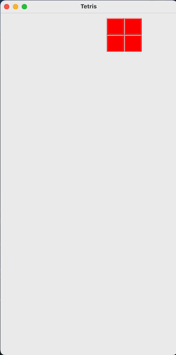

# Tetris

This is a window-based implementation of the famous game Tetris. This was put together thanks to content from educational site [zetcode](https://zetcode.com/). The app features a simple GUI. You play Tetris by moving the blocks before they hit the bottom so that you fill as many horizontal rows as possible. Once a row is filled, it will be removed. You gain a point for each row removed. Game over occurs when the blocks reach the top of the window.

## Demo



## Installation and Usage

1. Clone the repository:
```
git clone https://github.com/djbartolini/Tetris.git
```

2. Compile:
```
cd Tetris
javac -d target/classes src/*.java
```

3. Run:
```
java -cp target/classes Tetris
```

## Controls

| Command | Output              |
|---------|---------------------|
| &#8679; | Rotate Left         |
| &#8681; | Rotate Right        |
| &#8680; | Move Right          |
| &#8678; | Move Left           |
| `D`     | Move Down 1 Line    |
| `SPACE` | Move Down to bottom |

